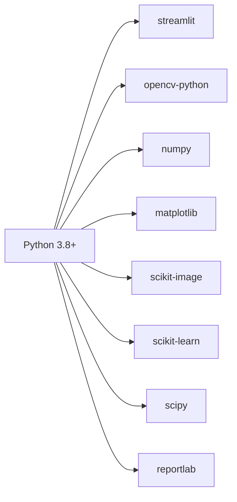
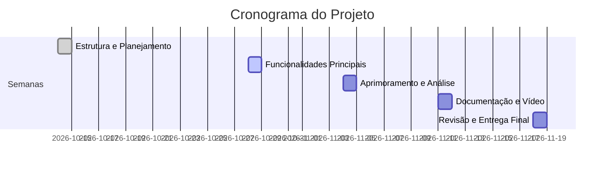
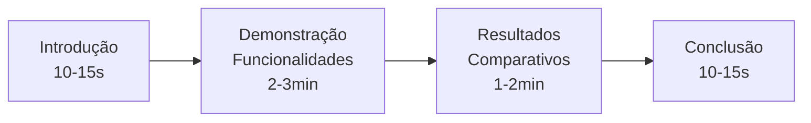
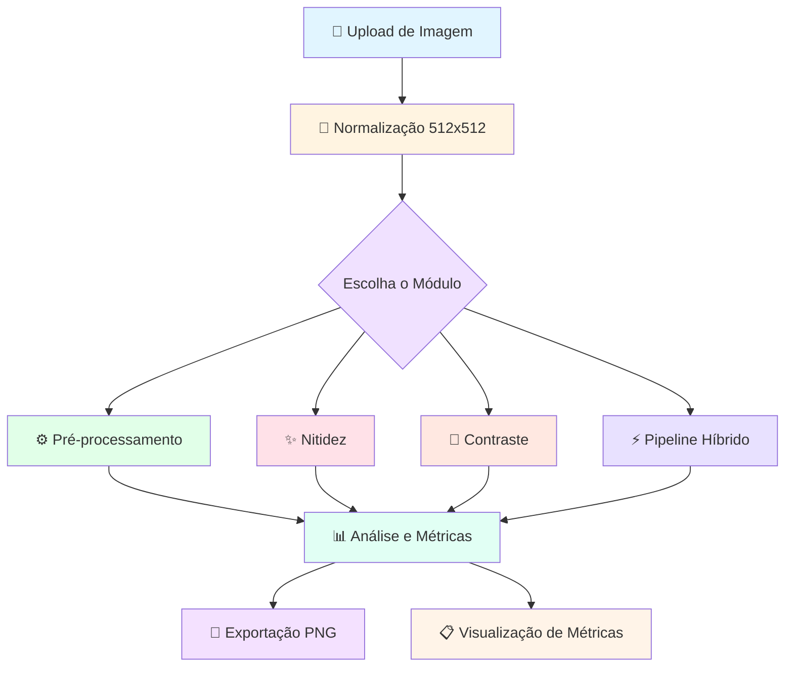

<div align="center">

# 🖼️ Realce no Domínio Espacial — Grupo 6
O Sistema ainda falta implementação de forma contextual de acordo com o que foi solicitado na descrição do projeto e de acordo com os Obejtivos, exemplo: Contexto Municipal.

### 🎓 Sistema de Processamento de Imagens Digital
### 🏙️ Projeto Véridia


</div>

---

## 📋 Descrição do Projeto

> **Contexto:** A cidade de **Véridia** busca revolucionar o processamento de imagens digitais nos setores de educação, saúde e indústria.

A prefeitura contratou vocês para desenvolver um **Sistema de Processamento de Imagens** robusto e modular, permitindo que operadores e administradores:

- 🔍 Processem imagens com alta precisão
- 🎨 Apliquem filtros e transformações avançadas
- 📊 Realizem análises de padrões
- 📝 Mantenham registro completo de resultados
- 📈 Gerem relatórios detalhados de processamento

### 🐍 Stack Tecnológica Principal

| Biblioteca | Descrição | Versão Recomendada |
|------------|-----------|-------------------|
| `streamlit` | Interface web interativa | >= 1.28.0 |
| `opencv-python` (cv2) | Processamento de imagens e visão computacional | >= 4.5.0 |
| `pillow` (PIL) | Manipulação básica de imagens | >= 8.0.0 |
| `numpy` | Computação numérica e arrays multidimensionais | >= 1.21.0 |
| `matplotlib` | Visualização e plotagem de dados | >= 3.3.0 |
| `scikit-image` | Algoritmos de processamento científico | >= 0.18.0 |
| `scikit-learn` | Machine learning e análise de dados | >= 1.0.0 |
| `scipy` | Computação científica avançada | >= 1.7.0 |
| `reportlab` | Geração de relatórios PDF | >= 3.6.0 |

---

## 🎯 Objetivos do Sistema

<table>
<tr>
<td width="50%">

### 🎯 Objetivos Principais

- ✅ **Centralização:** Unificar o processamento de imagens em uma única plataforma
- ✅ **Controle:** Facilitar a aplicação de filtros e transformações controladas
- ✅ **Integridade:** Garantir consistência nos resultados

</td>
<td width="50%">

### 🚀 Objetivos Avançados

- ✅ **Análise:** Permitir análise detalhada de padrões e componentes
- ✅ **Inovação:** Incentivar pesquisa e novas técnicas
- ✅ **Escalabilidade:** Sistema modular e extensível

</td>
</tr>
</table>

---

## 🛠️ Tecnologias e Bibliotecas

<div align="center">

### 💻 Desenvolvimento Modular e Inteligente

*Sistema capaz de analisar, transformar, comparar e gerar relatórios sobre imagens digitais*

**Versão Atual:** `v3.0` | **Interface:** Streamlit

</div>

### 📦 Instalação Rápida

```bash
pip install streamlit opencv-python pillow numpy matplotlib scikit-image scikit-learn scipy reportlab
```

### 🚀 Execução do Sistema

```bash
streamlit run sistema_processamento_imagens_v3.py
```

### 📚 Bibliotecas Essenciais



| Categoria | Bibliotecas | Função |
|-----------|-------------|--------|
| 🎨 **Interface Web** | `streamlit` | Interface interativa e responsiva |
| 🔢 **Computação Numérica** | `numpy`, `scipy` | Arrays e operações matemáticas avançadas |
| 🖼️ **Processamento de Imagens** | `opencv-python`, `PIL`, `scikit-image` | Manipulação e análise de imagens |
| 📊 **Visualização** | `matplotlib` | Gráficos e plotagens |
| 🤖 **Machine Learning** | `scikit-learn` | Algoritmos de aprendizado e métricas |
| 📄 **Relatórios** | `reportlab` | Geração de documentos PDF profissionais |

### 🌟 Características do Sistema

<table>
<tr>
<td align="center" width="33%">

#### 🎯 Interface Streamlit
Web app responsiva e intuitiva

</td>
<td align="center" width="33%">

#### ⚡ Processamento Real-Time
Visualização instantânea dos resultados

</td>
<td align="center" width="33%">

#### 📊 Métricas Avançadas
PSNR, SSIM, LC e Edge Sharpness

</td>
</tr>
</table>

> **Nota:** Cada grupo terá tarefas específicas e complementares, com atividades principais múltiplas e desafios avançados.

---

## 📌 Grupo 6 - Realce no Domínio Espacial

<div align="center">

### 🎯 Especialização: Técnicas de Realce e Contraste

</div>

<details open>
<summary><b>📋 Lista Completa de Tarefas (Clique para expandir/recolher)</b></summary>

<br>

| # | Tarefa | Complexidade |
|---|--------|--------------|
| 1️⃣ | Implementar o que foi proposto na Unidade I | ⭐⭐⭐⭐⭐ | Ainda Falta De forma Contextual Municipal e Outras Áreas
| 2️⃣ | Aplicar técnicas de realce de nitidez no domínio espacial | ⭐⭐⭐ |
| 3️⃣ | Implementar equalização local de contraste (CLAHE) | ⭐⭐⭐⭐ |
| 4️⃣ | Comparar resultados de realce global e local, medir nitidez e variação de intensidade | ⭐⭐⭐⭐ |
| 5️⃣ | Criar visualização comparativa entre diferentes parâmetros de realce | ⭐⭐⭐ |
| 6️⃣ | Desenvolver função híbrida combinando suavização e realce local | ⭐⭐⭐⭐⭐ |
| 7️⃣ | Documentar todo o processo | ⭐⭐ |
| 8️⃣ | Elaborar um artigo científico demonstrando todo o processo realizado | ⭐⭐⭐⭐⭐ |

</details>

### 🔬 Detalhamento das Atividades

<table>
<tr>
<td width="33%">

#### 🔧 Implementação Base
- Unidade I completa
- Estrutura modular
- Testes iniciais

</td>
<td width="33%">

#### 🎨 Técnicas de Realce
- Nitidez espacial
- CLAHE avançado
- Comparações métricas

</td>
<td width="33%">

#### 📊 Análise e Documentação
- Visualizações comparativas
- Função híbrida
- Artigo científico

</td>
</tr>
</table>

---

## 📅 Plano de Implementação - Entregas

<div align="center">

### ⏱️ Cronograma de 5 Semanas — Total: 8,0 pontos

</div>



---

### 📍 Semana 01 | 14/10 — Estrutura e Planejamento do Módulo

<table>
<tr>
<td width="70%">

**🎯 Objetivos:**
- Criar a base do projeto em Python (Google Colab ou ambiente local)
- Definir as funções principais e o fluxo de execução do módulo
- Iniciar a configuração do repositório no GitHub e inserir o README inicial

**📦 Entregáveis:**
- Repositório GitHub configurado
- Estrutura de pastas definida
- README.md inicial

</td>
<td width="30%" align="center">

### 💯 Pontuação

<h1>1,0</h1>

**ponto**

</td>
</tr>
</table>

---

### 📍 Semana 02 | 28/10 — Implementação das Funcionalidades Principais

<table>
<tr>
<td width="70%">

**🎯 Objetivos:**
- Desenvolver as funções centrais definidas na Unidade I
- Testar o funcionamento com diferentes imagens
- Registrar resultados iniciais e atualizar o repositório

**📦 Entregáveis:**
- Código funcional das funções principais
- Testes com múltiplas imagens
- Commits organizados no GitHub

</td>
<td width="30%" align="center">

### 💯 Pontuação

<h1>1,5</h1>

**pontos**

</td>
</tr>
</table>

---

### 📍 Semana 03 | 04/11 — Aprimoramento e Análise dos Resultados

<table>
<tr>
<td width="70%">

**🎯 Objetivos:**
- Realizar novos testes com outras imagens
- Corrigir falhas de execução e aprimorar os resultados visuais
- Inserir prints e tabelas de comparação no repositório

**📦 Entregáveis:**
- Código otimizado e corrigido
- Prints comparativos
- Tabelas de métricas

</td>
<td width="30%" align="center">

### 💯 Pontuação

<h1>2,0</h1>

**pontos**

</td>
</tr>
</table>

---

### 📍 Semana 04 | 11/11 — Documentação, Análise e Vídeo Demonstrativo

<table>
<tr>
<td width="70%">

**🎯 Objetivos:**
- Elaborar a documentação parcial em formato `.pdf`
  - Objetivos do projeto
  - Metodologia aplicada
  - Imagens utilizadas
  - Resultados obtidos
- Adicionar descrição técnica no `README.md` e no arquivo final
- Produzir um vídeo curto (máx. 5 min) demonstrando o funcionamento
- Publicar o vídeo na pasta `/demo`
- Finalizar o repositório com commits organizados

**📦 Entregáveis:**
- Documentação PDF completa
- Vídeo demonstrativo (.mp4)
- README.md atualizado
- Repositório finalizado

</td>
<td width="30%" align="center">

### 💯 Pontuação

<h1>2,0</h1>

**pontos**

</td>
</tr>
</table>

---

### 📍 Semana 05 | 18/11 — Revisão e Entrega Final

<table>
<tr>
<td width="70%">

**🎯 Objetivos:**
- Revisar todo o código
- Limpar comentários desnecessários
- Ajustar nomes de arquivos
- Garantir a execução correta do projeto
- Entregar o link final do repositório

**📦 Entregáveis:**
- Código revisado e limpo
- Projeto 100% funcional
- Link do repositório no Classroom

</td>
<td width="30%" align="center">

### 💯 Pontuação

<h1>1,5</h1>

**pontos**

</td>
</tr>
</table>

---

<div align="center">

### 📊 Distribuição de Pontos

| Semana | Entrega | Pontos | Acumulado |
|:------:|---------|:------:|:---------:|
| 1️⃣ | Estrutura e Planejamento | 1,0 | 1,0 |
| 2️⃣ | Funcionalidades Principais | 1,5 | 2,5 |
| 3️⃣ | Aprimoramento e Análise | 2,0 | 4,5 |
| 4️⃣ | Documentação e Vídeo | 2,0 | 6,5 |
| 5️⃣ | Revisão e Entrega Final | 1,5 | **8,0** |

</div>

---

## 📤 ENTREGA NO CLASSROOM (Google Sala de Aula)

<div align="center">

### ⚠️ Diretrizes de Submissão

</div>

<table>
<tr>
<td width="50%">

#### 📋 Critérios de Avaliação

- ✅ **Avaliação Semanal:** Cada grupo será avaliado semanalmente
- ✅ **Colaboradores:** Todos os integrantes devem ser adicionados ao repositório
- ✅ **Postagem:** Link do repositório no Google Classroom nas datas definidas
- ✅ **Participação Individual:** Commits serão analisados para avaliar contribuição
- ✅ **Qualidade:** Versões devem estar funcionais e documentadas

</td>
<td width="50%">

#### 🎯 Requisitos de Entrega

- 📝 Código funcional e testado
- 📚 Documentação completa
- 🎥 Vídeo demonstrativo (máx. 5 min)
- 💾 Commits organizados e frequentes
- 🔗 Link válido no Classroom
- ✨ README.md detalhado

</td>
</tr>
</table>

---

### 📁 Nomenclatura do Repositório

<div align="center">

#### 🏷️ Padrão Obrigatório

```
Processamento de Imagens_E01_GrupoX
```

> ⚠️ **Importante:** Substituir "X" pelo número do seu grupo

</div>

---

### 💡 Exemplo Prático

<table>
<tr>
<th>Grupo</th>
<th>Nome do Repositório</th>
<th>Visibilidade</th>
</tr>
<tr>
<td align="center">Grupo 1</td>
<td><code>Processamento de Imagens_E01_Grupo1</code></td>
<td align="center">🌐 Público</td>
</tr>
<tr>
<td align="center">Grupo 6</td>
<td><code>Processamento de Imagens_E01_Grupo6</code></td>
<td align="center">🌐 Público</td>
</tr>
<tr>
<td align="center">Grupo 10</td>
<td><code>Processamento de Imagens_E01_Grupo10</code></td>
<td align="center">🌐 Público</td>
</tr>
</table>

---

## 📁 Estrutura Obrigatória do Repositório

<div align="center">

### 🏗️ Organização de Arquivos e Pastas

</div>

```
📦 Processamento de Imagens_E01_GrupoX
│
├── 📂 src/
│   ├── 📄 main.ipynb                    # Notebook principal
│   ├── 📄 processamento.py              # Módulos de processamento
│   ├── 📄 filtros.py                    # Implementação de filtros
│   ├── 📄 metricas.py                   # Cálculo de métricas
│   └── 📄 utils.py                      # Funções auxiliares
│
├── 📂 imagens/
│   ├── 📂 originais/                    # Imagens de entrada
│   │   ├── 🖼️ imagem01.png
│   │   ├── 🖼️ imagem02.jpg
│   │   └── 🖼️ imagem03.jpeg
│   │
│   └── 📂 processadas/                  # Resultados do processamento
│       ├── 🖼️ resultado01.png
│       ├── 🖼️ resultado02.png
│       └── 🖼️ comparativo.png
│
├── 📂 docs/
│   ├── 📄 semana01.pdf                  # Documentação semanal 01
│   ├── 📄 semana02.pdf                  # Documentação semanal 02
│   ├── 📄 semana03.pdf                  # Documentação semanal 03
│   ├── 📄 semana04.pdf                  # Documentação semanal 04
│   ├── 📄 documentacao_final.pdf        # Documentação completa
│   └── 📄 artigo_cientifico.pdf         # Artigo do projeto
│
├── 📂 demo/
│   └── 🎥 video_demonstracao.mp4        # Vídeo de demonstração (máx. 5 min)
│
├── 📂 resultados/
│   ├── 📊 graficos/                     # Gráficos e visualizações
│   ├── 📈 metricas/                     # Tabelas de métricas
│   └── 📋 comparacoes/                  # Análises comparativas
│
└── 📄 README.md                          # Documentação principal do projeto
```

---

### 📝 Conteúdo do README.md

<details>
<summary><b>🔍 Clique para ver os requisitos completos do README</b></summary>

<br>

O arquivo `README.md` deve conter obrigatoriamente:

#### 1️⃣ Cabeçalho do Projeto
- Nome do projeto
- Número do grupo
- Nome dos integrantes
- Disciplina e instituição

#### 2️⃣ Objetivo do Módulo
- Descrição clara do que foi desenvolvido
- Contexto e aplicação
- Problemas resolvidos

#### 3️⃣ Bibliotecas Utilizadas
- Lista completa de dependências
- Versões recomendadas
- Comando de instalação

```bash
# Instalação de todas as dependências
pip install streamlit opencv-python pillow numpy matplotlib scikit-image scikit-learn scipy reportlab
```

#### 4️⃣ Instruções de Execução
- Pré-requisitos do sistema (Python 3.8+)
- Passo a passo para rodar o código
- Exemplos de uso

**Para executar o sistema:**

```bash
# Navegue até o diretório do projeto
cd Processamento_de_Imagens_E01_Grupo6

# Execute o sistema Streamlit
streamlit run sistema_processamento_imagens_v3.py
```

O sistema abrirá automaticamente no navegador em `http://localhost:8501`

#### 5️⃣ Funcionalidades Implementadas

| Módulo | Funcionalidades |
|--------|----------------|
| **Aquisição** | Upload, validação, normalização (512×512px) |
| **Pré-processamento** | Filtros Gaussiano, Mediana, Bilateral |
| **Nitidez** | Laplaciano, Alta Frequência, Unsharp Masking |
| **Contraste** | CLAHE local, Equalização global |
| **Análise** | PSNR, SSIM, LC, Edge Sharpness |
| **Híbrido** | Pipeline integrado personalizável |
| **Relatórios** | Exportação PNG, geração de métricas |

#### 6️⃣ Responsabilidades dos Integrantes
| Integrante | Responsabilidades |
|------------|-------------------|
| Nome 1 | Implementação CLAHE e contraste, Documentação |
| Nome 2 | Filtros de nitidez e pré-processamento, Testes |
| Nome 3 | Métricas de qualidade, Visualizações e Interface |
| Nome 4 | Pipeline híbrido, Relatórios PDF |

#### 7️⃣ Prints e Exemplos de Saída
- Screenshots do sistema funcionando
- Comparações antes/depois
- Gráficos de resultados
- Tabelas de métricas

#### 8️⃣ Parâmetros do Sistema

**Limiares de Qualidade:**
- PSNR: ≥ 30.0 dB
- SSIM: ≥ 0.85
- LC (Local Contrast): ≥ 0.12
- Edge Sharpness: 0.03 - 0.25

**Limites Operacionais:**
- Tamanho máximo de arquivo: 10 MB
- Resolução de processamento: 512×512 pixels
- Histórico de operações: até 10 ações

</details>

---

### 📊 Detalhamento das Pastas

<table>
<tr>
<th>Pasta</th>
<th>Descrição</th>
<th>Formato de Arquivos</th>
</tr>
<tr>
<td><code>📂 /src</code></td>
<td>Códigos-fonte do projeto em Python</td>
<td><code>.ipynb</code>, <code>.py</code></td>
</tr>
<tr>
<td><code>📂 /imagens</code></td>
<td>Conjunto de imagens utilizadas no projeto</td>
<td><code>.png</code>, <code>.jpg</code>, <code>.jpeg</code></td>
</tr>
<tr>
<td><code>📂 /docs</code></td>
<td>Documentação parcial e final do projeto</td>
<td><code>.pdf</code></td>
</tr>
<tr>
<td><code>📂 /demo</code></td>
<td>Vídeo demonstrativo do sistema</td>
<td><code>.mp4</code></td>
</tr>
<tr>
<td><code>📂 /resultados</code></td>
<td>Gráficos, métricas e análises</td>
<td><code>.png</code>, <code>.csv</code>, <code>.xlsx</code></td>
</tr>
<tr>
<td><code>📄 README.md</code></td>
<td>Documentação principal e guia do projeto</td>
<td><code>.md</code></td>
</tr>
</table>

---

## 🎥 Sobre o Vídeo Demonstrativo

<div align="center">

### 🎬 Especificações Técnicas

</div>

<table>
<tr>
<td width="50%" align="center">

#### ✅ Requisitos Obrigatórios

| Especificação | Valor |
|---------------|-------|
| **Formato** | `.mp4` |
| **Duração Máxima** | 5 minutos |
| **Resolução Mínima** | 720p (HD) |
| **Localização** | `/demo` no repositório |

</td>
<td width="50%" align="center">

#### 🎯 Conteúdo do Vídeo

- 🖥️ Execução do sistema
- 📊 Resultados obtidos
- 🎨 Visualizações comparativas
- 📈 Métricas e análises
- ❌ **Narração opcional**

</td>
</tr>
</table>

---

### 🎨 Sugestão de Estrutura do Vídeo



<details>
<summary><b>💡 Dicas para um Bom Vídeo Demonstrativo</b></summary>

<br>

#### ✨ Boas Práticas

1. **Qualidade Visual**
   - Use resolução mínima de 720p
   - Garanta boa iluminação nas capturas de tela
   - Mantenha o foco nos elementos importantes

2. **Conteúdo**
   - Mostre a execução real do código
   - Apresente imagens antes e depois do processamento
   - Exiba gráficos e métricas calculadas
   - Destaque os principais resultados

3. **Edição**
   - Corte momentos de espera desnecessários
   - Use zoom para destacar detalhes importantes
   - Adicione legendas ou anotações quando necessário

4. **Duração**
   - Seja objetivo e direto
   - Evite repetições
   - Foque nos pontos mais importantes

#### 🛠️ Ferramentas Sugeridas

- **Windows:** OBS Studio, Xbox Game Bar
- **Mac:** QuickTime, ScreenFlow
- **Linux:** SimpleScreenRecorder, Kazam
- **Online:** Loom, Screencast-O-Matic

</details>

---

### ⚠️ Pontos de Atenção

> **Importante:** O vídeo pode mostrar apenas a execução e os resultados obtidos, **sem necessidade de narração**. Porém, se optar por narrar, mantenha um tom profissional e objetivo.

---

## 🖥️ Telas do Sistema

<div align="center">

### 🎨 Interface Streamlit — Sistema v3.0

*Interface web moderna e responsiva com processamento em tempo real*

</div>

---

### 📸 1. Aquisição de Imagem

<table>
<tr>
<td width="60%">

#### 🔹 Funcionalidades

- **Upload de Arquivos:** Suporte para PNG, JPG, JPEG
- **Validação Automática:** Limite de 10 MB por arquivo
- **Normalização:** Redimensionamento automático para 512×512 pixels
- **Pré-visualização:** Exibição imediata da imagem carregada
- **Histórico:** Registro de todas as ações realizadas

</td>
<td width="40%">

#### 🛠️ Tecnologias

```python
# Bibliotecas utilizadas
import streamlit as st
import cv2
import numpy as np
from PIL import Image
```

**Interpolação:** LANCZOS4

</td>
</tr>
</table>

---

### ⚙️ 2. Pré-processamento (Suavização)

<table>
<tr>
<td width="60%">

#### 🔹 Filtros Disponíveis

- **Gaussiano:** Suavização com controle de sigma (0.5 - 2.0)
- **Mediana:** Remoção de ruído salt-and-pepper
- **Bilateral:** Preservação de bordas com suavização

#### 🎛️ Parâmetros Configuráveis

- Tipo de filtro (seleção)
- Raio do kernel (1-7 pixels, apenas ímpares)
- Sigma Gaussiano (0.5 - 2.0)

</td>
<td width="40%">

#### 📊 Recursos

- Preview em tempo real
- Comparação lado a lado
- Botão "Reverter"
- Botão "Restaurar Padrões"
- Histórico de ações

</td>
</tr>
</table>

---

### ✨ 3. Nitidez (Sharpening)

<table>
<tr>
<td width="60%">

#### 🔹 Técnicas Implementadas

- **Laplaciano 3×3:** Kernel padrão de realce
- **Alta Frequência:** Filtro passa-alta customizado
- **Unsharp Masking:** Subtração de versão suavizada

#### 🎛️ Parâmetros

- Método de nitidez (seleção)
- Peso do filtro (0.1 - 3.0)
- Limiar de supressão (0 - 100)
- Intensidade final (1.0 - 1.5)

</td>
<td width="40%">

#### 🛡️ Proteções

**Anti-Oversharpening:**
- Detecção automática de bordas
- Ajuste inteligente quando densidade > 0.20
- Aviso visual ao usuário

</td>
</tr>
</table>

---

### 🎨 4. Contraste

<table>
<tr>
<td width="60%">

#### 🔹 Métodos Disponíveis

- **CLAHE (Local):** Equalização adaptativa de histograma
  - Clip Limit: 2.0 - 3.0
  - Tile Size: 4, 8 ou 16 pixels
  
- **Equalização Global:** Equalização de histograma tradicional

#### 📊 Visualizações

- Comparação Original vs Processada
- Histogramas sobrepostos (RGB + Grayscale)
- Diferença absoluta entre imagens

</td>
<td width="40%">

#### 🔬 Análise Técnica

**CLAHE Características:**
- Processamento por canal RGB
- Conversão para espaço LAB
- Equalização apenas no canal L
- Retorno para RGB

</td>
</tr>
</table>

---

### ⚡ 5. Pipeline Híbrido

<table>
<tr>
<td width="100%">

#### 🔹 Processamento Integrado Personalizável

<details>
<summary><b>📋 Configuração Modular do Pipeline</b></summary>

<br>

O pipeline híbrido permite selecionar e combinar técnicas:

**Etapas Disponíveis:**

1️⃣ **Suavização Gaussiana** (Opcional)
   - Sigma: 0.5 - 2.0
   - Remove ruído antes do processamento

2️⃣ **CLAHE** (Opcional)
   - Clip Limit: 2.0 - 3.0
   - Tile Size: 4, 8 ou 16
   - Melhora contraste local

3️⃣ **Nitidez** (Opcional)
   - Método: Laplaciano ou Alta Frequência
   - Peso: 0.1 - 3.0
   - Intensidade: 1.0 - 1.5

**Ordem de Execução:**
```
Imagem Original → Suavização → CLAHE → Nitidez → Resultado Final
```

**Características:**
- ✅ Seleção livre de cada etapa
- ✅ Proteção anti-oversharpening automática
- ✅ Preview em tempo real
- ✅ Comparação com original
- ✅ Histórico de alterações (até 10 ações)

</details>

</td>
</tr>
</table>

---

### 📊 6. Análises e Métricas

<table>
<tr>
<td width="50%">

#### 🔹 Métricas de Qualidade

| Métrica | Descrição | Limiar |
|---------|-----------|--------|
| **PSNR** | Peak Signal-to-Noise Ratio | ≥ 30.0 dB |
| **MSE** | Mean Squared Error | - |
| **SSIM** | Structural Similarity Index | ≥ 0.85 |
| **LC** | Local Contrast | ≥ 0.12 |

</td>
<td width="50%">

#### 🔹 Métricas de Nitidez

| Métrica | Descrição | Faixa |
|---------|-----------|-------|
| **Edge Sharpness** | Densidade de bordas | 0.03 - 0.25 |
| **Laplacian Variance** | Variação do operador | - |
| **Gradient Magnitude** | Magnitude do gradiente | - |

</td>
</tr>
</table>

#### 📈 Visualizações Disponíveis

- **Histogramas RGB:** Distribuição de intensidades por canal
- **Histograma Grayscale:** Distribuição em escala de cinza
- **Comparação Lado a Lado:** Original vs Processada
- **Diferença Absoluta:** Mapa de diferenças
- **Indicadores Visuais:** ✅ (OK) ou ❌ (Abaixo do limiar)

---

### 📄 7. Relatórios e Exportação

<table>
<tr>
<td width="100%">

#### 🔹 Opções de Exportação

**Formatos Disponíveis:**
- 📷 **PNG:** Download da imagem processada
- 📊 **Métricas:** Visualização em painel lateral
- 📝 **Histórico:** Registro completo de operações

#### 📊 Resumo do Sistema

O painel lateral exibe constantemente:
- **Informações da Imagem:**
  - Resolução: 512×512 pixels
  - Canais: RGB
  - Número de operações realizadas

- **Métricas de Qualidade:**
  - PSNR com indicador de status
  - SSIM com indicador de status
  - LC com indicador de status
  - Edge Sharpness com indicador de status

- **Controles do Sistema:**
  - 🔄 Resetar (limpa tudo)
  - 📋 Limpar Histórico
  - ↩️ Reverter última ação
  - 🔄 Restaurar parâmetros padrões

</td>
</tr>
</table>

---

<div align="center">

### 🎯 Fluxo Completo do Sistema v3.0



### 📊 Recursos Principais do Sistema

| Módulo | Funcionalidades | Status |
|--------|----------------|--------|
| **Aquisição** | Upload, validação, normalização 512×512 | ✅ Implementado |
| **Pré-processamento** | Gaussiano, Mediana, Bilateral | ✅ Implementado |
| **Nitidez** | Laplaciano, Alta Freq, Unsharp Mask | ✅ Implementado |
| **Contraste** | CLAHE local, Equalização global | ✅ Implementado |
| **Pipeline Híbrido** | Combinação personalizável de técnicas | ✅ Implementado |
| **Análise** | PSNR, SSIM, LC, Edge Sharpness | ✅ Implementado |
| **Exportação** | PNG, métricas, histórico | ✅ Implementado |

</div>

---

<div align="center">

## 🎓 Sistema de Processamento de Imagens v3.0

### Desenvolvido para o Projeto Véridia

[](https://python.org)
[](https://streamlit.io)
[](https://opencv.org)
[](https://scikit-image.org)

---

### 🛠️ Tecnologias

**Backend:** Python • OpenCV • NumPy • scikit-image • scipy  
**Frontend:** Streamlit  
**Relatórios:** ReportLab • Matplotlib  
**Métricas:** scikit-learn

---

**📚 Disciplina:** Processamento de Imagens  
**🏫 Instituição:** [Nome da Instituição]  
**👥 Grupo:** 6 - Realce no Domínio Espacial  
**📅 Ano:** 2025  
**📦 Versão:** 3.0

---

### 📞 Suporte e Documentação

💬 **Dúvidas?** Entre em contato através do GitHub Issues  
📖 **Documentação Completa:** Ver pasta `/docs`  
🎥 **Demo em Vídeo:** Ver pasta `/demo`  

---

*Última atualização: Outubro 2025*

</div>
